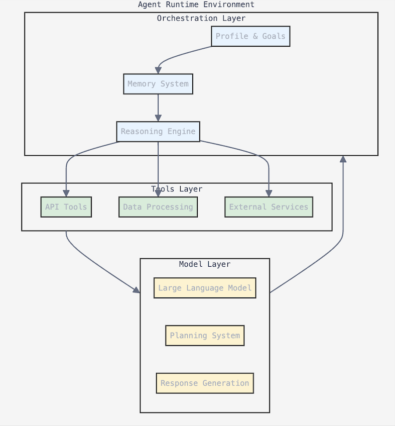

### Introduction to AI Agents

In the rapidly evolving landscape of artificial intelligence, AI agents represent a significant leap beyond conventional software applications. At their core, agents are software entities designed to perform autonomous actions by:
- Observing their environment
- Making decisions based on observations
- Taking actions to achieve specific goals
- Learning from outcomes

### The Evolution of AI Systems

To understand AI agents, it's crucial to recognize the progression of AI systems:

1. **Traditional Applications**
   - Fixed logic and predefined rules
   - Limited or no adaptation
   - Direct input-to-output mapping

2. **AI-Enhanced Applications**
   - Basic LLM integration
   - Single-step processing
   - Limited context awareness

3. **Agentic Systems**
   - Full autonomy in decision-making
   - Multi-step planning and execution
   - Dynamic tool usage
   - Continuous context awareness

### Understanding System Types

Modern AI implementations generally fall into three categories:

#### 1. Automations
- Execute predefined, rule-based tasks
- Follow fixed decision trees, best for deterministic tasks
- Best for: Repetitive, well-defined tasks
- Example:
  ```python
  def process_request(type):
      if type == "email":
          send_email()
      elif type == "report":
          generate_report()
  ```

#### 2. AI Workflows
- Combine LLMs with predefined processes
- Follow structured but flexible paths
- Best for: Complex but predictable tasks
- Example:
  ```python
  async def handle_customer_query(query):
      intent = await llm.classify_intent(query)
      response = await llm.generate_response(intent)
      if need_human_review(response):
          return escalate_to_human()
      return response
  ```

#### 3. True AI Agents
- Dynamically direct their own processes
- Maintain control over task execution
- Best for: Open-ended, adaptive tasks
- Example:
  ```python
  class ResearchAgent:
      async def solve_problem(self, query):
          plan = await self.create_plan(query)
          while not self.goal_achieved():
              next_step = self.determine_next_step(plan)
              result = await self.execute_step(next_step)
              plan = self.adjust_plan(result)
          return self.compile_results()
  ```

### Core Components of an Agent

A generic agent architecture, consists of several key components:


1. **Model Layer**
   - Central decision-making engine
   - Processes input and context
   - Generates reasoning and plans

2. **Orchestration Layer**
   - Manages the execution flow
   - Coordinates tool usage
   - Monitors progress towards goals

3. **Memory System**
   - Short-term working memory
   - Long-term knowledge storage
   - Context retention

4. **Tool Integration**
   - External API connections
   - Data processing capabilities
   - Action execution interfaces
   -


## The ReAct Framework

AI agents typically operate using the ReAct (Reason-Action) framework, which follows a cyclical pattern:

#### Framework Components:

1. **Thought**
   - Internal reasoning about the current state
   - Analysis of available information
   - Planning next steps

2. **Action**
   - Execution of chosen steps
   - Tool usage and integration
   - External system interaction

3. **Observation**
   - Gathering results
   - Analyzing outcomes
   - Updating understanding


